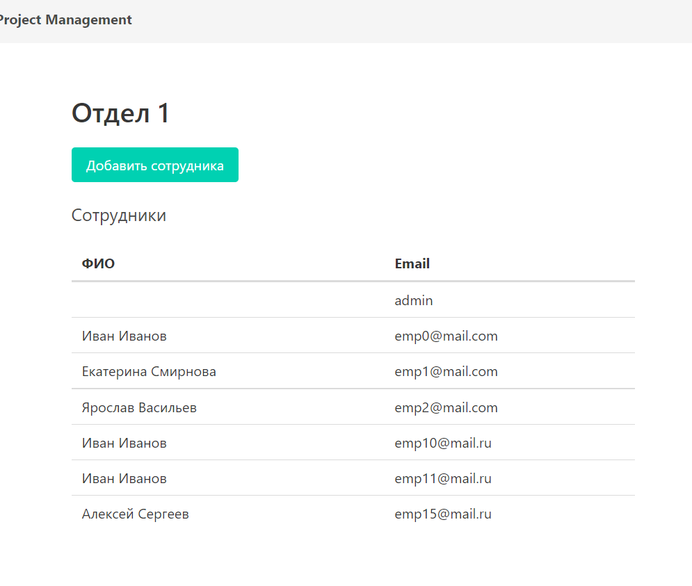

# Основной функционал веб-приложения

## Регистрация и авторизация
### Интерфейс регистрации

На странице отображается форма регистрации пользователя. Он должен ввести свои учетные данные. После регистрации пользователь
перенаправляется на страницу входа в систему. Если у пользователя уже есть аккаунт, он переходит по ссылке
на навигационной панели для авторизации

### Интерфейс авторизации

На странице отображается форма входа пользователя в систему. Он должен ввести свое имя пользователя и пароль. После входа пользователь перенаправляются на 
страницу личного аккаунта. 

## Личный аккаунт сотрудника

На данной странице отображено имя пользователя, кнопка для редактирования пользовательских данных,
а также кнопка для выхода из аккаунта.
Навигационная панель позволяет перейти к различным интерфесам:

- Интерфейс со списком клиентов и их контактной информацией
- Интерфейс отдела и всех сотрудников, относящихся к этому отделу
- Интерфейс со списком проектов

## Интерфейс для изменения информации о пользователе

Данный интерфейс предоставляет возможность изменить имя сотрудника. При сохранении изменений пользователь возвращается 
на страницу главного аккаунта

## Интерфейс с информацией о клиентах

На странице представлена таблица с клиентами и их контактной информацией. Можно воспользоваться поиском для того,
чтобы найти определенного клиента. Поиск осуществляется по полю Название, Контактное лицо, Email и номер телефона

В строке с каждым клиентом есть кнопка для того, чтобы отредактировать информацию. Также можно добавить нового клиента

## Интерфейс для изменения информации о клиенте

Форма для изменения информации о клиенте в базе данных и триггер для удаления

## Интерфейс для  добавления нового клиента

Форма для создания нового объекта модели Клиент

## Интерфейс отдела с сотрудниками

Таблица отдела и списк сотрудников, которые работают в этом отделе
У руквоводителя отдела есть возможность добавлять новых сотрудников в отдел при нажатии кнопки

## Интерфейс для добавления сотрудника к отделу

Интерфейс с функцией добавления нового сотрудника к отделу из зарегистрированных пользователей

## Интерфейс со списком проектов

Таблица с полным списком проектов. Отображение по 3 проекта на страницу и реализация пагинации для возможности перехода 
на следующую страницу. Фильтрация с поиском по названию проекта, диапозон дат начала проекта, упорядочить по дате начала,
фильтр по статусу с выбором опции из выпадающего списка
Есть кнопки для перехода к странице определенного проекта для просмотра подробной информации, а также кнопка для
добавления нового проекта

## Интерфейс со списком проектов

Форма для добавления нового проекта в базу данных

## Интерфейс проекта

Интерфейс с подробной информацией о проекте. Указаны все основные поля, а также список заданий.
Имеются кнопки для редактирования удаления проекта
Каждое задание можно открыть по кнопке, чтобы посмотреть всю информацию и удалить само задание

## Интерфейс для изменения проекта

Форма для изменения информации о проекте

## Интерфейс задания

## Интерфейс для изменения задания

## Интерфейс для добавления задания

