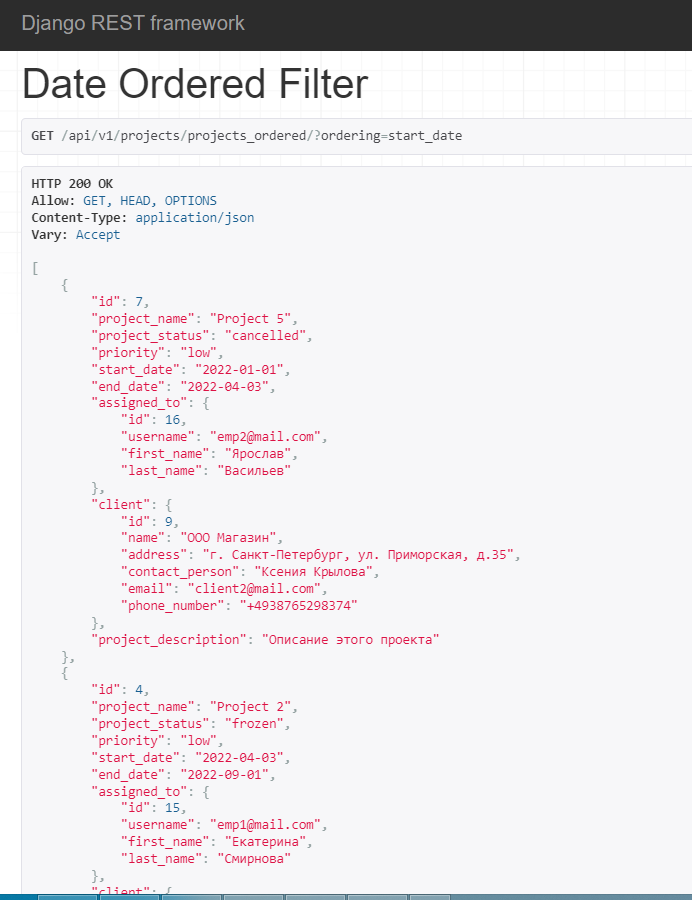
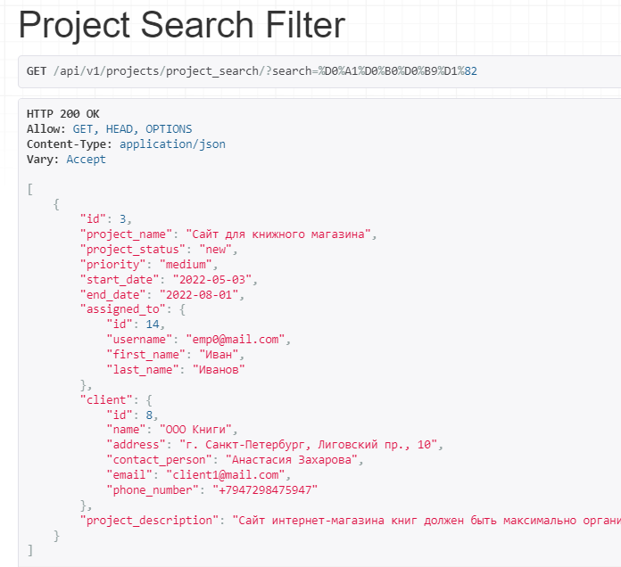
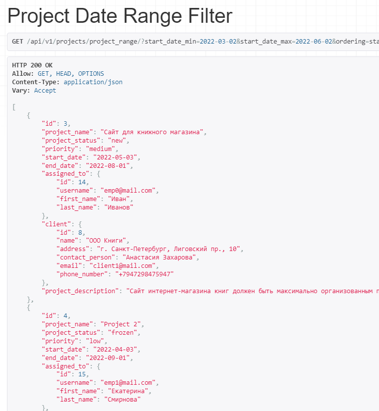

## Автоматические фильтры
### Фильтр проектов по дате

```python
class DateOrderedFilterView(ListAPIView):
    queryset = Project.objects.all()
    serializer_class = ProjectSerializer
    filter_backends = (OrderingFilter,)
    filterset_fields = ('start_date',)
```

### Фильтр поиска проекта по названию

```python
class ProjectSearchFilterView(ListAPIView):
    queryset = Project.objects.all()
    serializer_class = ProjectSerializer
    filter_backends = (SearchFilter,)
    search_fields = ('project_name',)
```


### Фильтрация по дате в промежутке

```python
class ProjectDateRangeFilterView(ListAPIView):
    queryset =  Project.objects.all()
    serializer_class = ProjectSerializer
    filterset_class = ProjectDateRangeFilter

filter.py

class ProjectDateRangeFilter(filters.FilterSet):
    start_date_min = filters.DateFilter(field_name="start_date", lookup_expr='gte')
    start_date_max = filters.DateFilter(field_name="start_date", lookup_expr='lte')

    class Meta:
        model = Project
        fields = ['start_date']
```