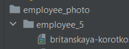

## Загрузка файлов
`validators.py`
```python
def validate_file_size(file):
    MAX_MB = 5
    limit = MAX_MB * 1024 * 1024
    if file.size > limit:
        raise ValidationError(f'The file size is more than {MAX_MB} MB.')
def validate_file_type(file):
    photo_extensions = ['image/png', 'image/jpeg', 'image/jpg']
    content_type = magic.from_buffer(file.read(), mime=True)
    if content_type not in photo_extensions:
        raise ValidationError(f'Files of type {content_type} are not supported.')
```
`models.py`
```python
def get_upload_path(instance, filename):
    return f'employee_photo/employee_{instance.employee.id}/{filename}'


class EmployeePhoto(models.Model):
    employee = models.ForeignKey(User,
                                    on_delete=models.CASCADE,
                                    related_name='employee_photos')
    file = models.FileField(
        validators=[validate_file_size, validate_file_type],
        upload_to=get_upload_path
    )
    file_name = models.CharField(max_length=100, blank=True, null=True)
    file_size = models.IntegerField(blank=True, null=True)

    def __str__(self):
        return f'Photo of {str(self.user)}'

    def save(self, *args, **kwargs):
        self.file_name = self.file.name
        self.file_size = self.file.size
        super(EmployeePhoto, self).save(*args, **kwargs)
```
`views.py`
```python
class EmployeePhotoCreateView(CreateAPIView):
    queryset = EmployeePhoto.objects.all()
    serializer_class = EmployeePhotoSerializer

# 2 AND MORE FILES UPLOAD
class MultipleEmployeePhotoCreateView(CreateAPIView):
    queryset = EmployeePhoto.objects.all()
    serializer_class = EmployeePhotoSerializer

    def post(self, request, *args, **kwargs):
        files = request.FILES.getlist('file')

        for file in files:
            employee_id = request.user.id
            file = EmployeePhoto(
                employee=User.objects.get(id=employee_id),
                file=file)
            file.save()

        return Response(str(request.data), status=status.HTTP_201_CREATED)

```
### Эндпоинт для загрузки файла


### Эндпоинт для загрузки нескольких файлов


