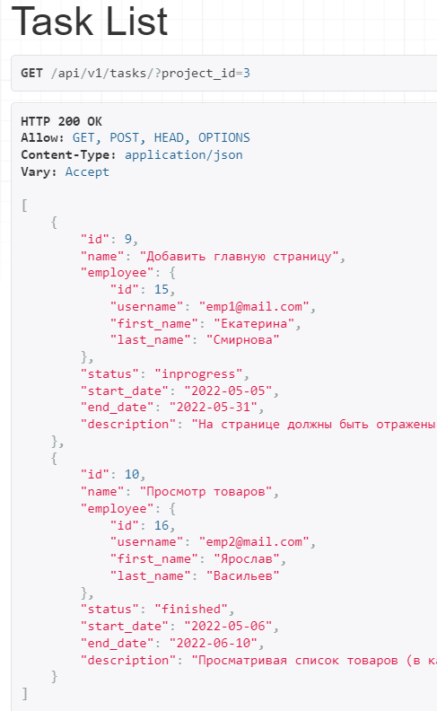
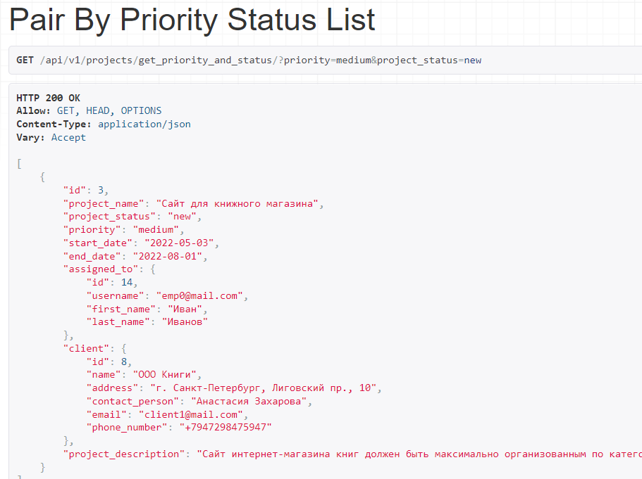
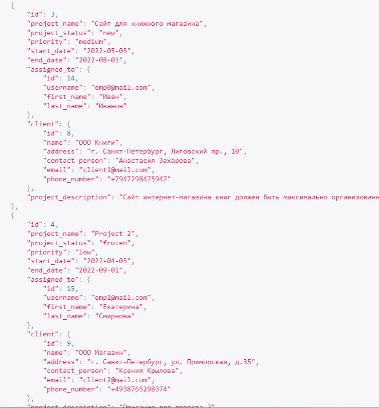

# Ручные фильтры

## Фильтрация по одному параметру
Фильтрация заданий проекта

`views.py`
```
class TaskViewSet(viewsets.ModelViewSet):
    serializer_class = TaskSerializer
    queryset = Task.objects.all()

    def get_queryset(self):
        project_id = self.request.GET.get('project_id')

        return self.queryset.filter(project_id=project_id)
```

**URL** : `tasks/?project_id=3`

**Content** :


## Фильтрация по двум параметрам
Фильтрация проекта по статусу и приоритету

`views.py`
```
class PairByPriorityStatusListView(ListAPIView):
    serializer_class = ProjectSerializer

    def get_queryset(self):
        pair_queryset = Project.objects.all()
        user = self.request.user

        if user.is_authenticated:
            priority = self.request.query_params.get('priority')
            status = self.request.query_params.get('project_status')

            pair_queryset = Project.objects.all()
            if priority and status:
                pair_queryset = pair_queryset.filter(priority=priority, project_status=status)

        return pair_queryset
```


**Content** :


## Фильтрация по двум параметрам и авторизованности пользователя
Фильтрация списка проектов по статусу и приоритету


**Content** : (для неавторизованного пользователя)


