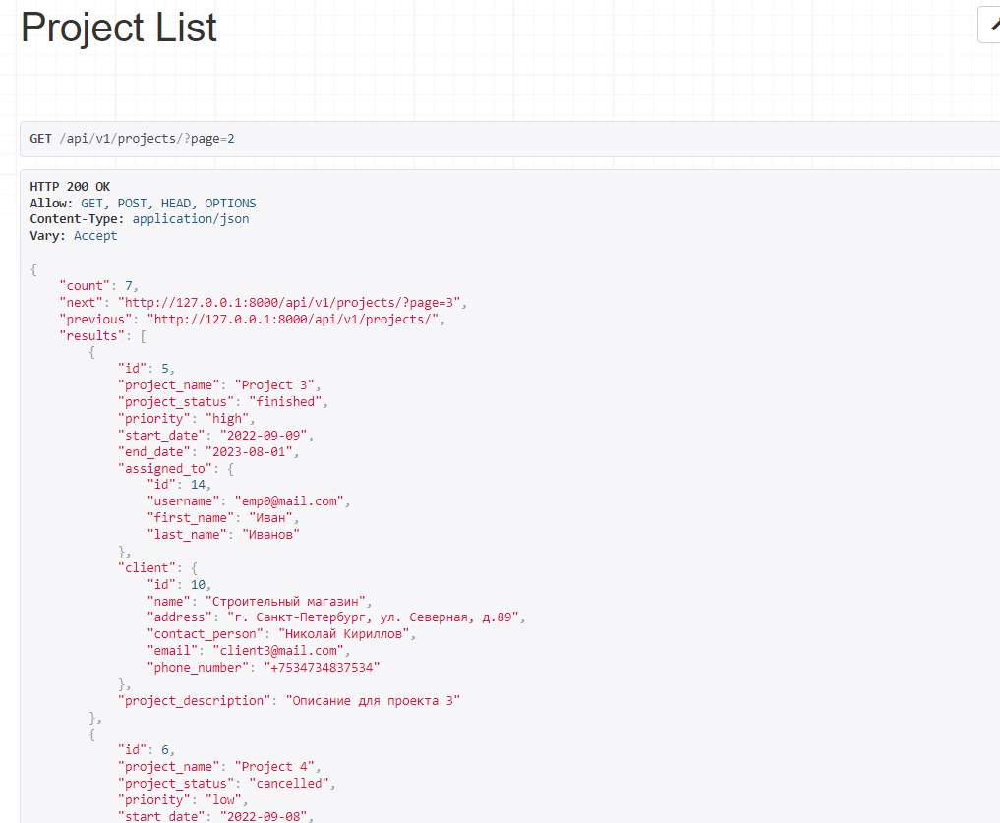

## Пагинация
Добавили в settings.py параметры для автоматической пагинации
```python
    'DEFAULT_PAGINATION_CLASS':
        'rest_framework.pagination.PageNumberPagination',
    'PAGE_SIZE': 3
```



`pagination.py`:
```python
class CustomPagination(pagination.PageNumberPagination):
    def get_paginated_response(self, data):
        return Response({
            'links': {
                'next': self.get_next_link(),
                'previous': self.get_previous_link()
            },
            'count': self.page.paginator.count,
            'results': data,
            'page_number': self.page.number,
            'num_pages': self.page.paginator.num_pages,
        })
```
