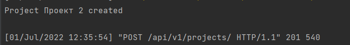
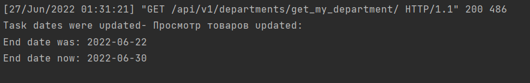

## Выполнение задания
### Сигнал при создании экземпляра класса

```python

@receiver(post_save, sender=Project)
def create_participant(sender, instance, created, **kwargs):
    if created:
        print(f'Project {instance.name} created\n')
```

### Сигнал при изменении экземпляра класса

```python
@receiver(pre_save, sender=Task)
def update_task(sender, instance, **kwargs):
    try:
        prev_instance = Task.objects.get(id=instance.id)
        instance.old_end_date = prev_instance.end_date
        print(f'Task dates were updated- {instance.name} updated: \n'
              f'End date was: {instance.old_end_date}\n'
              f'End date now: {instance.end_date}\n')
    except ObjectDoesNotExist:
        pass
```

### Сигнал при удалении экземпляра класса
```python
@receiver(pre_delete, sender=Project)
def delete_project(sender, instance, **kwargs):
    with open('deleted_projects_log.txt', 'a') as f:
        f.write(f'Project {instance.project_name} deleted\n')

```