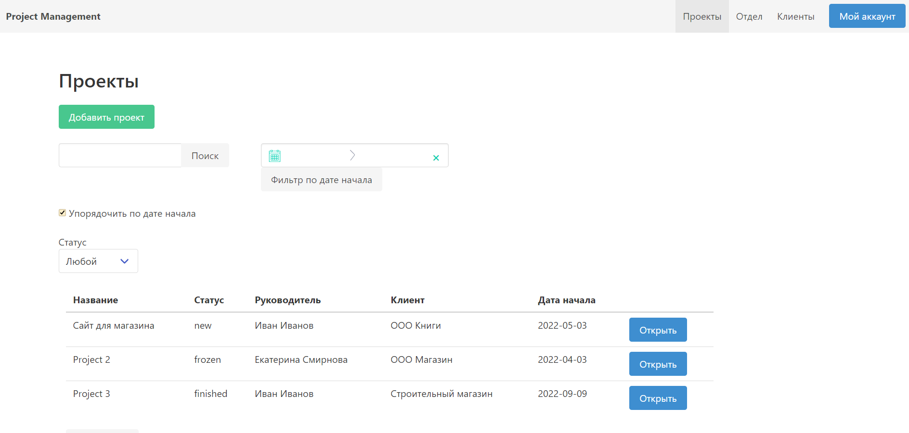

# Фильтрация и сортировка во Vue.js

На страницу с проектами добавлена возможность поиска и сортировки.

**URL** : `projects/`

## Сортировка объектов

Возможна сортировка по дате начала проекта

## Пагинация

Возможность перехода к другим частям списка проекта

## Поиск по объектам

Поиск ведется в названии проектов

## Фильтрация по полю статус

Можно выбрать проекты с определенным статусом

## Фильтры на диапазон

Можно задать диапазон даты начала проекта