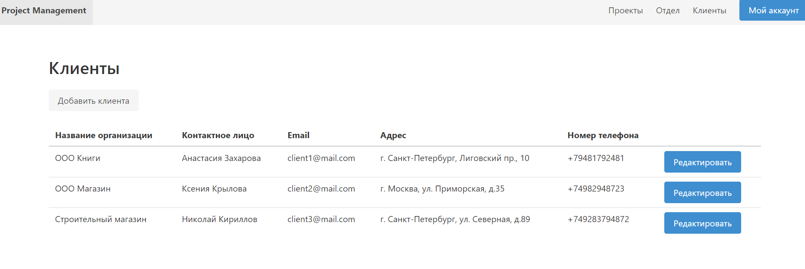

# Clients

**URL** : `/dashboard/clients`

### Description

The page displays the list of the clients and their contact information. At the top there is a button 
which takes to a page with a form to add new client. By clicking edit button next to client row
user will be taken to edit client page
The navigation bars contains links to other pages - department, projects, my account