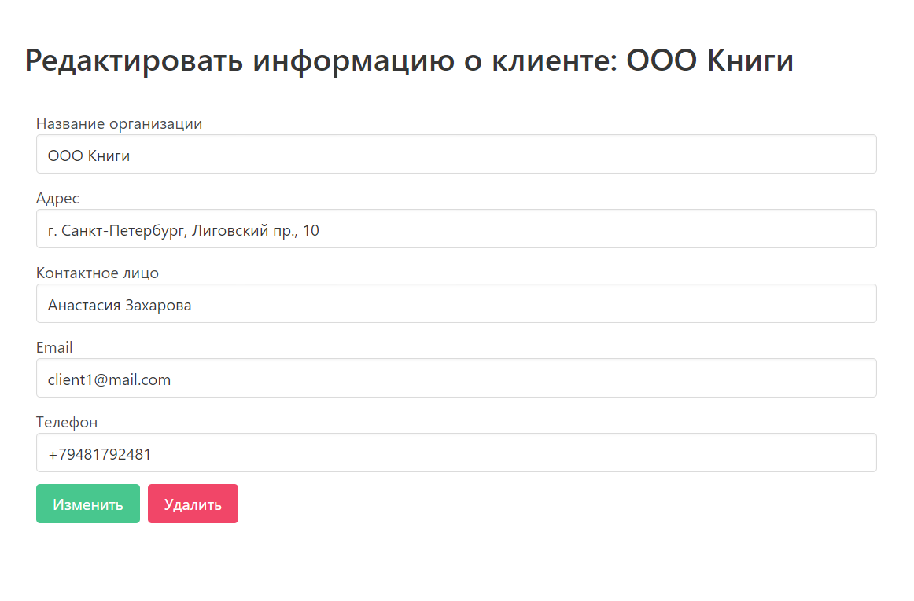

#  Edit client

**URL** : `/dashboard/clients/edit`

### Description

The page displays a form with clients information that can be edited. At the bottom
there is a button to save changes and return to clients page