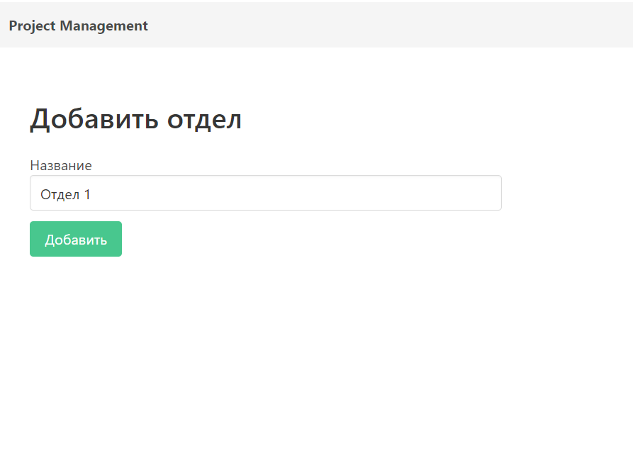

# Add department

**URL** : `/dashboard/departments/add`

### Description

The page displays a form to create new department by filling the name. The user who created department
will be automatically assigned to and also becomes the lead of department
with option to add other employees. At the bottom
there is a button to save the information and return to department page