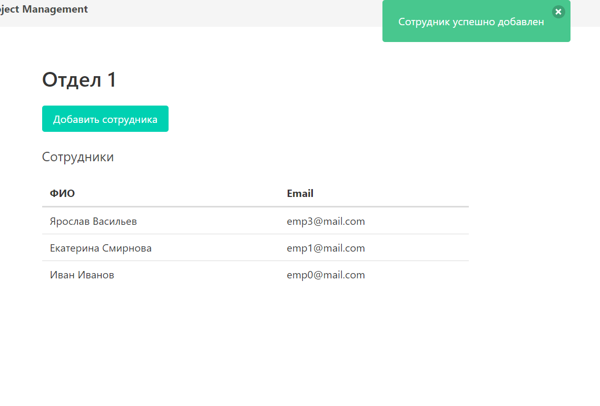
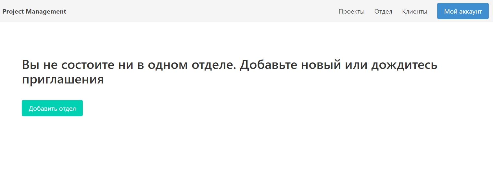

# Department

**URL** : `/dashboard/department`

### Description

The page displays information about the department the user is assigned to and all
other employees that are also assigned.
In case if user does not belong to any department they will see
a message saying they are not assigned and button which takes to add new department page. The user
can also be assigned to department by other user