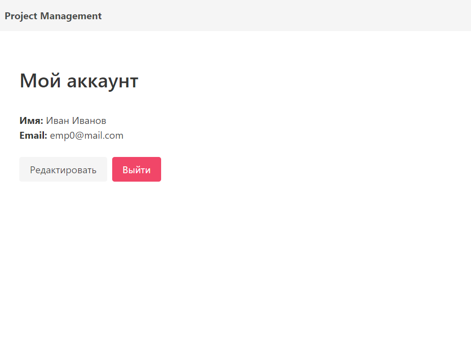

# User profile

**URL** : `/dashboard/my-account`

### Description

The page shows the employee's name and email. The user can change the information by clicking edit button and also logout 
from the account. At the top there is a navigation bar which can take user to department,
clients, projects pages.